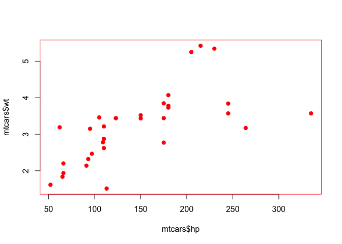

<!-- README.md is generated from README.Rmd. Please edit that file -->

# withr - run code ‘with’ modified state 

[](https://travis-ci.org/r-lib/withr)
[](https://ci.appveyor.com/project/jimhester/withr)
[](https://codecov.io/github/r-lib/withr?branch=master)
[](http://www.r-pkg.org/pkg/withr)

## Overview

withR makes working with global state in R safer and less error prone.
Many functions in R modify global state, which makes programming
difficult. withR allows you to do this temporarily, and safely. These
functions set one of the global settings for duration of a block of
code, then automatically reset it after the block is completed.

## Installation

``` r
#Install the latest version with:
install.packages("withr")
```

Many of these functions were originally a part of the
[devtools](https://github.com/hadley/devtools) package, this provides a
simple package with limited dependencies to provide access to these
functions.

  - `set_makevars()`
  - `defer()`
  - `defer_parent()`
  - `with_collate()` / `local_collate()` - collation order
  - `with_connection()` / `local_connection()` - R connections.
  - `with_db_connection()` / `local_db_connection()`
  - `with_dir()` / `local_dir()` - working directory
  - `with_environment()` / `local_environment()`
  - `with_envvar()` / `local_envvar()` - environment variables
  - `with_libpaths()` / `local_libpaths()` - library paths
  - `with_locale()` / `local_locale()` - any locale setting
  - `with_makevars()` / `local_makevars()` - Makevars variables
  - `with_message_sink()` / `local_message_sink()`
  - `with_options()` / `local_options()` - options
  - `with_output_sink()` / `local_output_sink()`
  - `with_par()` / `local_par()` - graphics parameters
  - `with_path()` / `local_path()` - PATH environment variable
  - `with_preserve_seed()`
  - `with_rng_version()` / `local_rng_version()`
  - `with_seed()`  
  - `with_temp_libpaths()` / `local_temp_libpaths()`
  - `with_timezone()` / `local_timezone()`
  - `with_*()` and `local_*()` functions for the built in R devices,
    `bmp`, `cairo_pdf`, `cairo_ps`, `pdf`, `postscript`, `svg`, `tiff`,
    `xfig`, `png`, `jpeg`.
  - `with_package()` / `local_package()`, `with_namespace()` /
    `local_namespace()` and `with_environment()` / `local_environment()`
    - to run code with modified object search paths.
  - `with_tempfile()` / `local_tempfile()` - Create and clean up a temp
    file.
  - `with_file()` / `local_file()` - Create and clean up a normal file.

## Usage

There are two sets of functions, those prefixed with `with_` and those
with `local_`. The former reset their state as soon as the `code`
argument has been evaluated. The latter reset when they reach the end of
their scope, usually at the end of a function body.

``` r
par("col" = "black")
my_plot <- function(new) {
  with_par(list(col = "red", pch = 19),
    plot(mtcars$hp, mtcars$wt)
  )
  par("col")
}
my_plot()
```

<!-- -->

    #> [1] "black"
    par("col")
    #> [1] "black"
    
    f <- function(x) {
      local_envvar(c("WITHR" = 2))
      Sys.getenv("WITHR")
    }
    
    f()
    #> [1] "2"
    Sys.getenv("WITHR")
    #> [1] ""

There are also `with_()` and `local_()` functions to construct new
`with_*` and `local_*` functions if needed.

``` r
Sys.getenv("WITHR")
#> [1] ""
with_envvar(c("WITHR" = 2), Sys.getenv("WITHR"))
#> [1] "2"
Sys.getenv("WITHR")
#> [1] ""

with_envvar(c("A" = 1),
  with_envvar(c("A" = 2), action = "suffix", Sys.getenv("A"))
)
#> [1] "1 2"
```

# See Also

  - [Devtools](https://github.com/hadley/devtools)
